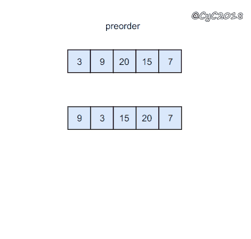

# 二叉树的镜像

## 题目描述

请完成一个函数，输入一个二叉树，该函数输出它的镜像。

例如输入：


示例 1：

```text
输入：root = [4,2,7,1,3,6,9] 
输出：[4,7,2,9,6,3,1]
```

限制：

`0 <= 节点个数 <= 1000`


来源：力扣（LeetCode） 链接：[https://leetcode-cn.com/problems/er-cha-shu-de-jing-xiang-lcof](https://leetcode-cn.com/problems/er-cha-shu-de-jing-xiang-lcof) 著作权归领扣网络所有。商业转载请联系官方授权，非商业转载请注明出处。


## 题解

```go
func mirrorTree(root *TreeNode) *TreeNode {
  if root == nil{
		return root
	}
	temp := new(TreeNode)
	temp = root.Left
	root.Left = root.Right
	root.Right = temp
	mirrorTree(root.Left)
	mirrorTree(root.Right)
  return root
}
```




