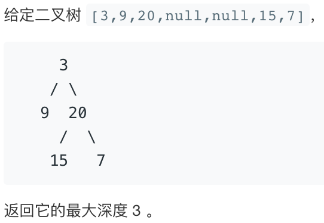

# 求树的深度

输入一棵二叉树的根节点，求该树的深度。从根节点到叶节点依次经过的节点（含根、叶节点）形成树的一条路径，最长路径的长度为树的深度。

例如：



提示：

`节点总数 <= 10000`


来源：力扣（LeetCode） 链接：[https://leetcode-cn.com/problems/er-cha-shu-de-shen-du-lcof](https://leetcode-cn.com/problems/er-cha-shu-de-shen-du-lcof) 著作权归领扣网络所有。商业转载请联系官方授权，非商业转载请注明出处。


## 题解

```go
func maxDepth(root *TreeNode) int {
  if root == nil{
		return 0
	}else{
		l := maxDepth(root.Left)
		r := maxDepth(root.Right)
		if l > r{
			return l + 1
		}else{
			return r + 1
		}
	}
}
```

